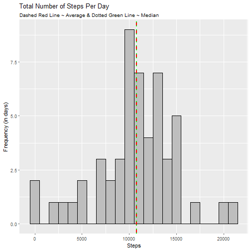

Reproducible Research Course Project 1
=======================

#Michael Nichols

###Basic assumptions:
- assumes activity data downloaded and unzipped into working directory 

Load packages

```r
library(ggplot2)
library(dplyr)
library(gridExtra)
```

Loading and preprocessing the data (with initial assumption that we can ignore missing values)

```r
file <- "activity.csv"
activity <- read.csv(file)
activity <- subset(activity, is.na(activity$steps) == FALSE)
```

###Task 1: What is mean total number of steps taken per day?
1. Calculate the total number of steps taken per day
2. If you do not understand the difference between a histogram and a barplot, research the difference between them. Make a histogram of the total number of steps taken each day
3. Calculate and report the mean and median of the total number of steps taken per day

Find mean total number of steps taken per day

```r
DailySteps <- aggregate(activity$steps, by = list(activity$date), sum)
names(DailySteps) <- c("Day", "Steps")
```

create histogram of daily steps

```r
p <- ggplot(DailySteps, aes(x = Steps)) + geom_histogram(color = "black", fill = "grey", binwidth = 1000) + ggtitle("Total Number of Steps Per Day")
```

annotate histogram with mean and median data and then display

```r
p <- p + geom_vline(aes(xintercept = mean(Steps)), color = "red", linetype = "dashed", size = 1)
p <- p + geom_vline(aes(xintercept = median(Steps)), color = "green", linetype = "dotted", size = 1) 
p <- p + labs(y = "Frequency (in days)") 
p <- p + ggtitle(labs(subtitle = "Dashed Red Line ~ Average & Dotted Green Line ~ Median"))
print(p)
```



Calculate mean and median steps per day

```r
meanSteps <- mean(DailySteps$Steps)
print(meanSteps)
```

```
## [1] 10766.19
```

```r
medianSteps <- median(DailySteps$Steps)
print(medianSteps)
```

```
## [1] 10765
```

###Task 2: What is the average daily activity pattern?
1. Make a time series plot (i.e. type = "l") of the 5-minute interval (x-axis) and the average number of steps taken, averaged across all days (y-axis)
2. Which 5-minute interval, on average across all the days in the dataset, contains the maximum number of steps?

Aggregate steps by 5-minute interval (x-axis) by the average number of steps taken, averaged across all days (y-axis)

```r
StepsPer5 <- aggregate(activity$steps, by = list(activity$interval), mean)
names(StepsPer5) <- c("Interval", "AverageSteps")
```

Create time series plot and then display

```r
p2 <- ggplot(NULL, aes(y = StepsPer5$AverageSteps, x = StepsPer5$Interval)) 
p2 <- p2 + geom_line() + geom_point() 
p2 <- p2 + labs(y = "Average Steps per 5 Minute Interval", x = "5 Minute Time Interval Number") 
p2 <- p2 + ggtitle(label = "Time Series Plot of Average Steps Per 5-Min Time Interval", subtitle = "Time Intervals: 0 = '12:00-12:05AM' to 2355 = '11:55PM - 12:00AM'")
print(p2)
```


Display highest average step count per interval & interval in which the highest average occurs

```r
Max5MinSteps <- max(StepsPer5$AverageSteps)
print(Max5MinSteps)
```

```
## [1] 206.1698
```

```r
max5MinInterval <- StepsPer5[StepsPer5$AverageSteps == Max5MinSteps,]
print(max5MinInterval)
```

```
##     Interval AverageSteps
## 104      835     206.1698
```

###Task 3: Imputing missing values
###Assumption: Note that there are a number of days/intervals where there are missing values (coded as NA). - The presence of missing days may introduce bias into some calculations or summaries of the data.

1. Calculate and report the total number of missing values in the dataset (i.e. the total number of rows with NAs)
2. Devise a strategy for filling in all of the missing values in the dataset. The strategy does not need to be sophisticated. For example, you could use the mean/median for that day, or the mean for that 5-minute interval, etc.
3. Create a new dataset that is equal to the original dataset but with the missing data filled in.
4. Make a histogram of the total number of steps taken each day and Calculate and report the mean and median total number of steps taken per day. Do these values differ from the estimates from the first part of the assignment? What is the impact of imputing missing data on the estimates of the total daily number of steps?

Reread in dataset & count number of missing values & percentage of total

```r
activity2 <- read.csv(file)

percentMissing <- sum(is.na(activity2$steps)) / (sum(!is.na(activity2$steps)) + sum(is.na(activity2$steps)))
print(percentMissing)
```

```
## [1] 0.1311475
```

Replace missing vales with average per 5 min interval (StepsPer5 data frame)

```r
for (i in 1:length(activity2$steps)) {
  if (is.na(activity2$steps[i] == TRUE)) {
  activity2$steps[i] <- StepsPer5$AverageSteps[match(activity2$interval[i], StepsPer5$Interval)]
  }
}
```

Show new dataset

```r
str(activity2)
```

```
## 'data.frame':	17568 obs. of  3 variables:
##  $ steps   : num  1.717 0.3396 0.1321 0.1509 0.0755 ...
##  $ date    : Factor w/ 61 levels "2012-10-01","2012-10-02",..: 1 1 1 1 1 1 1 1 1 1 ...
##  $ interval: int  0 5 10 15 20 25 30 35 40 45 ...
```

```r
summary(activity2$steps)
```

```
##    Min. 1st Qu.  Median    Mean 3rd Qu.    Max. 
##    0.00    0.00    0.00   37.38   27.00  806.00
```

# 4. Make a histogram of the total number of steps taken each day and Calculate and report the 
# mean and median total number of steps taken per day. Do these values differ from the estimates 
# from the first part of the assignment? What is the impact of imputing missing data on the 
# estimates of the total daily number of steps?

Create new data frame of total daily steps with average data for missing values

```r
DailySteps3 <- aggregate(activity2$steps, by = list(activity2$date), sum)
names(DailySteps3) <- c("Day", "FullSteps")
```

Create histogram of daily steps with substituted missing values

```r
p3 <- ggplot(DailySteps3, aes(x = FullSteps)) + geom_histogram(color = "black", fill = "grey", binwidth = 1000) + ggtitle(label = "Total Number of Steps Per Day")

# annotate histogram with mean and median data
p3 <- p3 + geom_vline(aes(xintercept = mean(FullSteps)), color = "red", linetype = "dashed", size = 1) 
p3 <- p3 + geom_vline(aes(xintercept = median(FullSteps)), color = "green", linetype = "dotted", size = 1) 
p3 <- p3 + labs(y = "Frequency (in days)", x = "Total Steps") 
# add subtitle explaining mean and median lines
p3 <- p3 + ggtitle(labs(subtitle = "Simulated Data for Missing Values; Dashed Red Line ~ Average & Dotted Green Line ~ Median"))

#print histogram
print(p3)
```


Calculate mean and median

```r
meanFullSteps <- mean(DailySteps3$FullSteps)
print(meanFullSteps)
```

```
## [1] 10766.19
```

```r
medianFullSteps <- median(DailySteps3$FullSteps)
print(medianFullSteps)
```

```
## [1] 10766.19
```

Compare daily step calculations with missing vs simulated data
### Summary below shows the substitutions by interval worked very well, keeping the mean & median the same; the major change only comes in the sum of steps, which rises by 86000 (8 avg days)

```r
DailyComp <- merge(DailySteps, DailySteps3, all.y = TRUE)
summary(DailyComp)
```

```
##          Day         Steps         FullSteps    
##  2012-10-01: 1   Min.   :   41   Min.   :   41  
##  2012-10-02: 1   1st Qu.: 8841   1st Qu.: 9819  
##  2012-10-03: 1   Median :10765   Median :10766  
##  2012-10-04: 1   Mean   :10766   Mean   :10766  
##  2012-10-05: 1   3rd Qu.:13294   3rd Qu.:12811  
##  2012-10-06: 1   Max.   :21194   Max.   :21194  
##  (Other)   :55   NA's   :8
```

```r
diffSteps <- sum(DailySteps3$FullSteps) - sum(DailySteps$Steps)
print(diffSteps)
```

```
## [1] 86129.51
```

### Are there differences in activity patterns between weekdays and weekends?

Create a new factor variable in the dataset with two levels -- "weekday" and "weekend" indicating whether a given date is a weekday or weekend day.


```r
#reformat date variable as date (from factor)
activity2$date <- as.Date(as.character(activity2$date))

#append weekday var to data frame
activity2 <- mutate(activity2, Weekday = weekdays(activity2$date))

#adjust weekday variable (as factor) for weekday vs weekend
for (i in 1:length(activity2$steps)) {
  if (activity2$Weekday[i] %in% c("Monday", "Tuesday", "Wednesday", "Thursday", "Friday")) {
    activity2$Weekday[i] <- "Weekday"
  }  else {
    activity2$Weekday[i] <- "Weekend"
  }
}
activity2$Weekday <- as.factor(activity2$Weekday)
```

Make a panel plot containing a time series plot (i.e. type = "l") of the 5-minute interval (x-axis) and the average number of steps taken, averaged across all weekday days or weekend days (y-axis). The plot should look something like the following, which was created using simulated data:


```r
# create 2 subsets and aggregate by average per interval once again 
weekdaySteps <- subset(activity2, activity2$Weekday == "Weekday")
weekendSteps <- subset(activity2, activity2$Weekday == "Weekend")

StepsPer5Weekday <- aggregate(weekdaySteps$steps, by = list(weekdaySteps$interval), mean)
StepsPer5Weekend <- aggregate(weekendSteps$steps, by = list(weekendSteps$interval), mean)
names(StepsPer5Weekday) <- c("Interval", "AverageWeekdaySteps")
names(StepsPer5Weekend) <- c("Interval", "AverageWeekendSteps")

#new data frame for 5 min intervals by weekday & weekend
StepsPer5Grouped <- merge(StepsPer5Weekday, StepsPer5Weekend)
```


```r
# create stacked ggplots with labels on only selected charts and consistent y axis limits
p4 <- ggplot(NULL, aes(y = StepsPer5Grouped$AverageWeekdaySteps, x = StepsPer5Grouped$Interval)) 
p4 <- p4 + geom_line() + geom_point() + ylim(0, 235)
p4 <- p4 + ggtitle(labs(y = "Average Number of Steps", x = ""))
p4 <- p4 + ggtitle(label = "Time Series Plot of Average Steps Per 5-Min Time Interval", subtitle = "Weekday")


p5 <- ggplot(NULL, aes(y = StepsPer5Grouped$AverageWeekendSteps, x = StepsPer5Grouped$Interval)) 
p5 <- p5 + geom_line(color = "grey") + geom_point(color = "purple") + ylim(0, 235) 
p5 <- p5 + ggtitle(labs(y = "", x = "5 Minute Time Interval")) 
p5 <- p5 + ggtitle(labs(subtitle = "Weekend"))

grid.arrange(p4, p5, ncol = 1)
```


